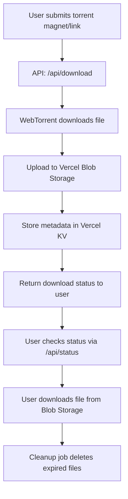

# Torrent Downloader App

A serverless torrent downloader that allows users to download torrents directly to cloud storage, with real-time status updates and automatic cleanup. Designed for easy deployment on Vercel, but can be adapted for other platforms.

## Features

- Download torrents directly to cloud storage (Vercel Blob)
- Store download metadata and status in Vercel KV
- Automatic cleanup of expired files (via scheduled jobs)
- Real-time download status updates
- Responsive UI built with Next.js and Tailwind CSS
- Files auto-expire after 24 hours to minimize storage costs

## Tech Stack

- **Frontend:** Next.js 15, React 18, Tailwind CSS
- **Backend:** Next.js API Routes, WebTorrent
- **Storage:** Vercel Blob, Vercel KV
- **Deployment:** Vercel (with Cron Jobs for cleanup)

## Project Structure & Flow



### Detailed Flow
1. **User submits a torrent magnet/link** via the web UI.
2. **API Route `/api/download`** receives the request and starts the download using WebTorrent.
3. **WebTorrent** downloads the file to a temporary location.
4. **File is uploaded to Vercel Blob Storage** for persistent, scalable storage.
5. **Metadata and status** are stored in Vercel KV for tracking and retrieval.
6. **User receives a status update** and can check progress via `/api/status`.
7. **User downloads the file** from Blob Storage once complete.
8. **Scheduled cleanup job** (Vercel Cron) deletes expired files and metadata after 24 hours.

## Local Development Setup

1. **Clone the repository:**
   ```bash
   git clone https://github.com/PrabhasMahanti123/torrent_downloader_app.git
   cd torrent_downloader_app
   ```
2. **Install dependencies:**
   ```bash
   npm install
   # or
   pnpm install
   ```
3. **Set up environment variables:**
   - Copy `.env.example` to `.env.local` and fill in your Vercel credentials:
     - `BLOB_READ_WRITE_TOKEN`
     - `KV_REST_API_URL`
     - `KV_REST_API_TOKEN`
4. **Run the development server:**
   ```bash
   npm run dev
   ```
5. **Open [http://localhost:3000](http://localhost:3000)** in your browser.

## Deployment (Vercel)

1. **Push your code to GitHub.**
2. **Connect your repository to Vercel.**
3. **Add Blob Storage and KV Database** via Vercel Dashboard → Storage.
4. **Set environment variables** in Vercel Project Settings:
   - `BLOB_READ_WRITE_TOKEN`
   - `KV_REST_API_URL`
   - `KV_REST_API_TOKEN`
5. **Deploy!**

## Environment Variables

| Variable                | Description                        |
|-------------------------|------------------------------------|
| `BLOB_READ_WRITE_TOKEN` | Vercel Blob storage access token   |
| `KV_REST_API_URL`       | Vercel KV database URL             |
| `KV_REST_API_TOKEN`     | Vercel KV database token           |

## Limitations

- Files must be processed within 60 seconds (Vercel Pro timeout)
- Suitable for smaller torrents (< 100MB recommended)
- Files expire after 24 hours
- Processing happens synchronously during the API call
 
